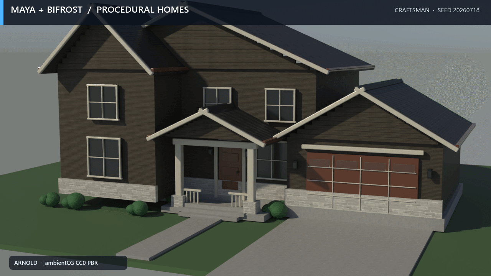

# dcc-mcp-maya-procedural-architecture

High-detail residential architecture for Maya. The skill builds seeded
craftsman, farmhouse, cottage, Tudor, coastal, and modern-farmhouse exteriors
with material-separated Bifrost structural graphs and instanced finish details.
It supports both physically based realistic and brighter stylized looks, with
CC0 PBR textures, optional HDR environments, Arnold lights, and a staged camera
orbit.



The 1280×720 Arnold showcase cycles six deterministic houses. Every house is
held for 1.5 seconds so its architecture and realistic/stylized look remain
readable. The [six-style contact sheet](docs/showcase/turntable-contact-sheet.jpg)
shows the full comparison under a shared ambientCG HDR environment.

House-specific code lives here. The Maya adapter keeps only generic typed
Bifrost/VNN graph operations, while `dcc-asset-ambientcg` owns asset discovery
and downloads.

## Tools

- `generate_realistic_house` — works through an interactive Maya sidecar and
  in `mayapy` standalone; `look` accepts `realistic` or `stylized`.
- `show_house_generator` — opens a Maya Qt dialog with style/look selection,
  seeded randomization, cancellable progress, and QTimer main-thread dispatch.

## PBR asset flow

Use the marketplace `ambientcg-assets` skill to search and download four CC0
materials and, optionally, one CC0 HDRI. Pass its returned `AssetDescriptor`
objects by role:

```json
{
  "material_assets": {
    "siding": {"asset_id": "ambientcg:WoodSiding008", "variants": [], "attribution": {}},
    "roof": {"asset_id": "ambientcg:RoofingTiles013A", "variants": [], "attribution": {}},
    "brick": {"asset_id": "ambientcg:Bricks060", "variants": [], "attribution": {}},
    "concrete": {"asset_id": "ambientcg:Concrete034", "variants": [], "attribution": {}}
  },
  "environment_asset": {
    "asset_id": "ambientcg:DaySkyHDRI001A",
    "variants": [],
    "attribution": {"license_spdx": "CC0-1.0"}
  },
  "workspace_dir": "C:/absolute/house-workspace",
  "seed": 20260718,
  "style": "coastal",
  "look": "realistic"
}
```

The abbreviated objects above show routing only; pass the complete descriptors
returned by the provider. The generator extracts color, roughness, OpenGL
normal, AO, and displacement maps, connects the HDR to an Arnold SkyDome, adds
an Arnold Area key light, and writes `asset_attribution.json` beside the assets.

## Standalone

Set `MAYA_LOCATION` to the Maya installation directory, then run:

```powershell
$mayapy = Join-Path $env:MAYA_LOCATION "bin\mayapy.exe"
$workspace = Join-Path $PWD "house-workspace"
& $mayapy `
  examples\build_house_standalone.py `
  --assets assets.json `
  --workspace $workspace `
  --output (Join-Path $workspace "realistic-house.ma") `
  --environment environment-hdr.json `
  --style tudor `
  --look stylized `
  --seed 20260718
```

`assets.json` contains the role-to-AssetDescriptor mapping;
`environment-hdr.json` contains the optional HDR AssetDescriptor. In Maya GUI,
load the skill and call `show_house_generator` with the same descriptors.

## Stability contract

- Generation is capped at 420 planned parts and reuses one prototype mesh per
  detail role through Maya instances.
- Viewport refresh, undo recording, and auto-key are guarded and restored even
  after errors or cancellation; partial generated nodes are removed.
- Interactive generation is queued with `QTimer.singleShot(0, ...)` and exposes
  stage/percentage progress plus Cancel.
- Standalone explicitly clears the scene and uninitializes Maya before process
  exit so Bifrost and Arnold release cleanly.

## Development

```powershell
vx ruff check skill tests examples
vx ruff format --check skill tests examples
vx uv run --with pytest --with pyyaml pytest
vx uv run --with "dcc-mcp-core>=0.19" python `
  -c "from dcc_mcp_core import validate_skill; report=validate_skill('skill/maya-procedural-architecture'); print(report); assert not report.has_errors"
```

## License

Code is MIT licensed. Downloaded material assets are not bundled; each
AssetDescriptor and generated manifest retains the provider's CC0 license and
source URL.

## PyPI status: not published

This repository is an **agent skill pack**, not a distributable Python package.
It contains no importable module under `src/` — the deliverable is the set of
markdown skill definitions under `skill/`, which agents load from the repository
or the skill marketplace rather than via `pip install`.

It is therefore intentionally **not published to PyPI**, and no release
workflow exists for that purpose. Tracked in [PIP-3630][pip3630].

[pip3630]: https://monica.woa.com/issues/01a0d880-e0c8-7ee2-8f7c-ccc783e279dc
